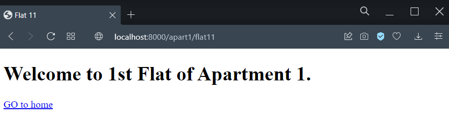
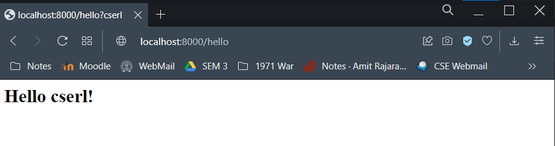

# Bootcamp Week 4: Enhancements to HTTP server

This week, you will add more features to the simple HTTP server built in the previous week. 
There is no new template code this week, you will only have to make simple changes to the existing code from week 3.

We have two exercises: [worker thread pool](#worker-thread-pool), and [dynamic HTTP responses](#dynamic-http-responses).
Once you are done with both of these, you can try to implement [other features](#other-features).

## Worker thread pool

So far, your web server was handling multiple clients by creating a separate thread for each client. However, thread creation is a high overhead task. Therefore, real-life multi-threaded servers use a pool of reusable worker threads instead. The main server creates a pool of worker threads at the start. Whenever a new client connection is accepted, the server places the accepted client file descriptor in a queue/array shared with the workers. Each worker thread fetches a client from this queue, and serves it as long as the client is connected. Once the client finishes and terminates, the worker thread goes back to the queue to get the next client to handle. In this way, the same pool of worker threads can serve multiple clients.

To begin, please watch this video to understand the multi-threaded design pattern of servers: [Video lecture on multi-threaded application design](https://youtu.be/TXZqpu4zmLI).

To design a thread pool, you may follow the given steps:

* First, create multiple threads.

* Next, you will need a shared buffer or queue to store the accepted client file descriptors. You can use a large array or a C++  [queue](https://www.cplusplus.com/reference/queue/queue/) or any such data structure for this purpose. 

* The main server thread and the worker threads must use locks to access this queue without race conditions. Here's a [video lecture on Locking](https://youtu.be/EBevKfTDXUI).

* You will need to use condition variables. Here's a [video lecture on Condition Variables](https://youtu.be/rMpOfbaP2PQ). 
You may also read these [notes on CVs](https://pages.cs.wisc.edu/~remzi/OSTEP/threads-cv.pdf).
The main server thread and worker threads will use condition variables to signal each other when clients are added or removed from the queue.

* Carefully study the various functions available to correctly use locks and condition variables from this [introduction to Pthread API](https://pages.cs.wisc.edu/~remzi/OSTEP/threads-api.pdf)

* Once your worker thread dequeues a client socket file descriptor from the shared queue, the rest of the handling of the client request will be the same as before. You should be able to reuse all of your server HTTP processing in the code of the worker thread. **Ensure that you release any locks** that the thread is holding before performing operations like disk reads for files: otherwise, the other threads may stall for the lock. 

After you make these changes, your server will be able to handle multiple clients concurrently as before, but without having to create a new thread for every client. Start your server in one terminal. Open separate terminals to start several different clients, and check that all of them can correctly communicate with the echo server. You can also print out some debug output to check that clients are correctly being assigned to worker threads, and that the worker thread is serving another client after the first client terminates.


## Dynamic HTTP responses

The simple HTTP server built in the previous week could only handle static web pages stored in the file system.  

Modify the server to handle dynamic HTTP responses as well. That is, you will also handle some URLs that do not correspond to any file in the HTML root directory, but will instead run some function to generate a dynamic HTTP response.

Your server should work like the following:

1. All the previous URLs should still work:

<p align="center">

</p>


2. The URL ```/hello?<name>``` should return a HTML response that says ```Hello <name>!```:


<p align="center">

</p>


3. The URL ```/fib?<n>``` should return a HTML response with the nth fibonacci number:


<p align="center">

</p>


Any other URL should return the standard 404 response.

To do this exercise, you can modify [the function](https://github.com/cserl-iitb/bootcamp2022/blob/438038440a4dbd0cc0b2b7730cb36302cf21f31f/application_software/week3/http_server.cpp#L40) that generates HTML responses to handle a wide variety of URLs in this manner.


### Templates

The above can be accomplished simply by generating the HTML response body using C++ strings. Something like:

```response->body = "<html> <h2> Hello " + name + "!</h2> </html>";```

However, you will need a more convenient way to generate HTML dynamically. The most common approach relies on templates. A template contains the static parts of the desired HTML output as well as some special syntax describing how dynamic content will be inserted. For example, the HTML file will have ```<html> <h2> Hello {{name}}!</h2> </html>```. Then, while returning the response, you can parse this HTML file to replace instances of ``{{name}}`` with the name you get from the URL. 


## Other features

You can add other enhancements to your web server to make it more realistic. 
Some suggestions are given below:

1. You can support more types of HTTP requests from the HTTP specifications.

2. You can return a more complete set of HTTP headers also in your responses. 

3. You can also support persistent connections and other features of HTTP 1.1. 

This part of the assignment is open-ended, and you can make your HTTP server as close to a real-world server as you wish. 
