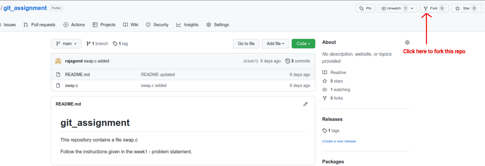

## Exploring Git & Github

The goal of this part of the assignment is to give you a chance to explore basic use of Git and GitHub. Git is a version control system that software developers use to manage source code. We also require you to host your code developed during bootcamp on a public platform like github. For this reason, it is useful to become familiar with its basic operations.

[Create](https://github.com/join) a github account and [install](https://git-scm.com/downloads) git on your computer, if you haven't already.

### Useful References

- [Git Tutorial for Beginners](https://youtu.be/8JJ101D3knE) (if you are  already familiar with basic git commands, feel free to skip ahead)
- [Setup git](https://docs.github.com/en/get-started/quickstart/set-up-git) (Optional)
- [A full tutorial on how to use GitHub](https://medium.com/@george.seif94/a-full-tutorial-on-how-to-use-github-88466bac7d42) (Optional)
- [Git Tutorial](https://linuxhint.com/git_tutorial_beginners/) (Optional)

  
   
  <a href="https://www.cs.swarthmore.edu/~adanner/help/git/">Git Overview</a>

### Basic git commands

- <code>git clone \<repository_url\></code>

Make a local copy of a remote repository on your machine.

- <code>git add \<filename\></code>

This stages the file. Only adding a file to the folder isn't enough to make git keep track of the file. Use add command to tell git that you want it to track the new file in this repository.

- <code>git status</code>
    
This shows you which files are already staged, and which files are changed but not staged.

- <code>git commit -m "\<commit message\>"</code>
    
Commits all files that you've added. The text inside the quotes after the "-m" is a message that will go into the log file(use <code>git log</code> to see log).

- <code>git push</code>
    
Send your changes to the remote repository.

- <code>git pull</code>
    
Get latest version from the remote repository. It helps you to avoid messing up your repository when you're in a collaboration.

Note: You may encounter with <code>fatal: Authentication failed</code> error when you try to authenticate your GitHub account from the terminal. Follow the steps given in this [link](https://techexpertise.medium.com/github-authentication-failure-when-clone-fetch-pull-and-push-78181212b4e3) to resolve this issue or this [link](https://youtu.be/ytSoabxSQ6E) if you prefer watching video.

Note: There are plenty of resources available online for more detailed reading. Feel free to look them up.

### Exercises

1. **Repository Creation**

    A. 
    
    - Clone [bootcamp2022](https://github.com/cserl-iitb/bootcamp2022) repo(use `git clone https://github.com/cserl-iitb/bootcamp2022.git` command).

    B.

    - Create a new private repository named **\<Bootcamp_2022_my_submission\>** (or any other similar name) from your account. 

    - Clone it on your local machine (use git clone \<url\> command).
  
    - Make a new folder named \<Week1_solutions\> inside it. 

    - copy files from **bootcamp2022/week1_warmup** directory to the \<Week1_solutions\> directory.

    - Do add, commit and push on your repository.
    
    - Push your solutions onto your repo periodically.

2. **Do you want to fix a bug?**

    - Fork [this](https://github.com/rajagond/git_assignment) repository. This will create a copy of repository on your account.  

    

    
    

    - Clone the repository you just created using fork from your github account onto your local machine (use git clone \<fork_url\> command).  

    

    
    

  
    - <code>cd git_assignment</code>

    - <code>git checkout -b \<new_branch\></code> ( **-b** flag tells Git to run <code>git branch \<new_branch\></code> before running <code>git checkout \<new_branch\></code>.)

    - Fix bug (test it) and add gitignore file to tells git to ignore a.out file.

    - <code>git add .</code>

    - <code>git commit -m "bug fixed"</code>

    - <code>git push -u origin \<new_branch\></code>

    - Now merge the \<new_branch\> into main by following below four commands:  
        <code>git checkout main</code>

        <code>git pull origin main</code>
        
        <code>git merge \<new_branch\></code>

        <code>git push -u origin main</code>

    - <code>git tag</code> (This command will print <code>submission</code> on terminal. Lookup online to know more about what <code>git tag</code> does.) Note that it prints <code>submission</code> because the <code>submission</code> tag was already created in the original repository.

    - Now, delete the <code>submission</code> tag from both local and remote repo.  
        <code>git tag -d submission</code>(delete local tags)

        <code>git push origin :refs/tags/submission</code>(push changes to remote repo)

        Alternative approach to delete remote and local tags  
        <code>git push --delete origin submission</code>

        <code>git tag -d submission</code>
        
    - Create a new tag <code>final_submission</code> and push it on your repository.

